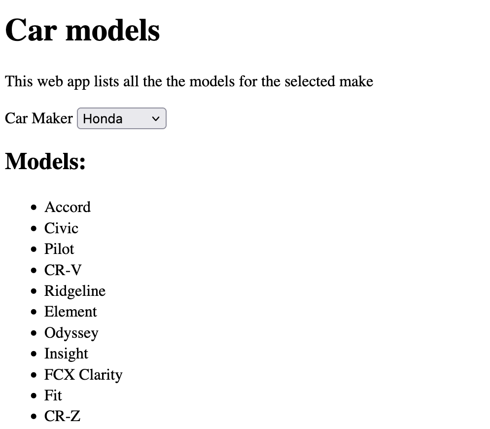

## JSON and AJAX Quiz


**Question**:
Complete the JavaScript code to fetch data from the NHTSA API endpoint `https://vpic.nhtsa.dot.gov/api/vehicles/GetModelsForMake/make`, which returns a list of all models for a given car make.  The data should be displayed in a list of `<li>` elements. You are asked to use either `fetch` or `XMLHTTPRequest` to make the AJAX request and parse the JSON response correctly.

**Instructions**:

1. Use the `fetch` or `XMLHTTPRequest` API to get data from `https://vpic.nhtsa.dot.gov/api/vehicles/GetModelsForMake/make?format=json`.
  - For example to get all models for the make Toyota, you will need to send an HTTP GET request to `https://vpic.nhtsa.dot.gov/api/vehicles/GetModelsForMake/Toyota?format=json`
2. Parse the JSON response.
  - The response should look like
  ```json
  {
    "Count": 57,
    "Message": "Response returned successfully",
    "SearchCriteria": "Make:Toyota",
    "Results": [
        {
            "Make_ID": 448,
            "Make_Name": "Toyota",
            "Model_ID": 2208,
            "Model_Name": "Corolla"
        },
        {
            "Make_ID": 448,
            "Make_Name": "Toyota",
            "Model_ID": 2211,
            "Model_Name": "Land Cruiser"
        },
        {
            "Make_ID": 448,
            "Make_Name": "Toyota",
            "Model_ID": 2213,
            "Model_Name": "Highlander"
        }
    ]
  }
  ```
3. Dynamically create list items (`<li>`) for each item in the JSON data.
4. Append the list items to the unordered list (`<ul>`) with the ID `modelList` in the HTML.

#### HTML Code
Below is the starter HTML code
```html
<body>

    <h1>Car models</h1>
    <p>This web app lists all the the models for the selected make</p>
    <label for="makeList">Car Maker</label>
    <select id="makeList">
        <option value="Toyota" selected>Toyota</option>
        <option value="BMW">BMW</option>
        <option value="Mercedes">Mercedes</option>
        <option value="Audi">Audi</option>
        <option value="Ford">Ford</option>
        <option value="Nissan">Nissan</option>
        <option value="Honda">Honda</option>
    </select>
    <h2>Models:</h2>
    <ul id="modelList">
    </ul>

</body>
```

#### JavaScript Code:
Below is the starter JavaScript code:

```javascript
const makeList = document.getElementById("makeList");
let make = makeList.value;

makeList.addEventListener("change", () => {
    make = makeList.value;
    getModels(make);
});


function getModels(make) {
    const API_URL = `https://vpic.nhtsa.dot.gov/api/vehicles/GetModelsForMake/${make}?format=json`


}

function appendModels(models) {
    const uiElem = document.getElementById("modelList");
    uiElem.innerHTML = "";
    for (const model of models) {
        const listItem = document.createElement('li');


    }
}
```

### Submission
Submit a link to GitHub pages by the due date.